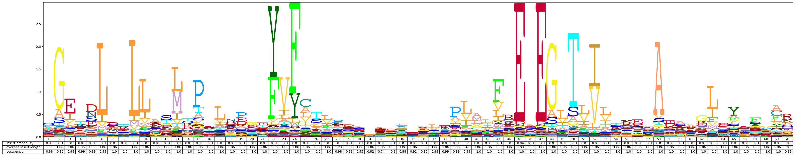

.. hmmlogo documentation master file, created by
   sphinx-quickstart on Mon Jun  8 21:36:49 2020.
   You can adapt this file completely to your liking, but it should at least
   contain the root `toctree` directive.

HMMLogo:  Visualizations for profile hidden Markov models
==================================================================

Visualizing `profile hidden Markov models (pHMMs) <https://en.wikipedia.org/wiki/HMMER#Profile_HMMs>`_ is easy with HMMLogo.

----------------------------------------

Download a visualization of the pHMM with Pfam accession ``PF10000``
with just a few lines of code::

  import hmmlogo
  hmmlogo.save_svg('PF10000', 'hmm.svg')

This will create a logo of the pHMM and save it as ``hmm.svg``.

  
.. toctree::
   :maxdepth: 2
   :caption: Contents:

   install
   api

Indices and tables
==================

* :ref:`genindex`
* :ref:`modindex`
* :ref:`search`
